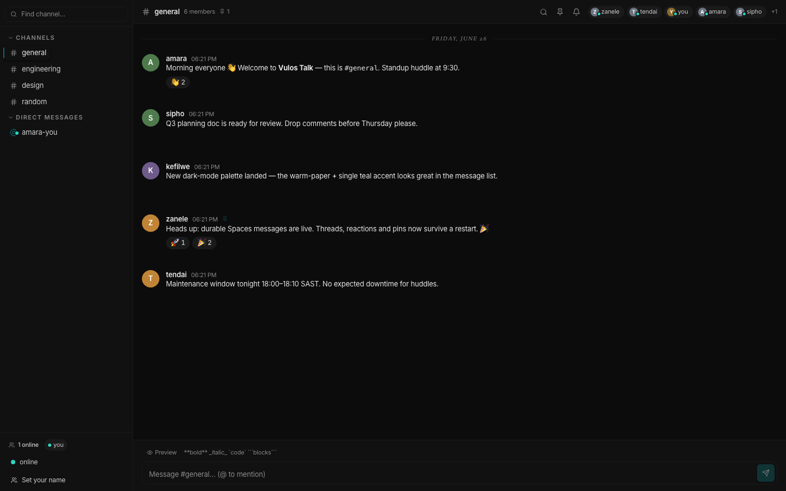
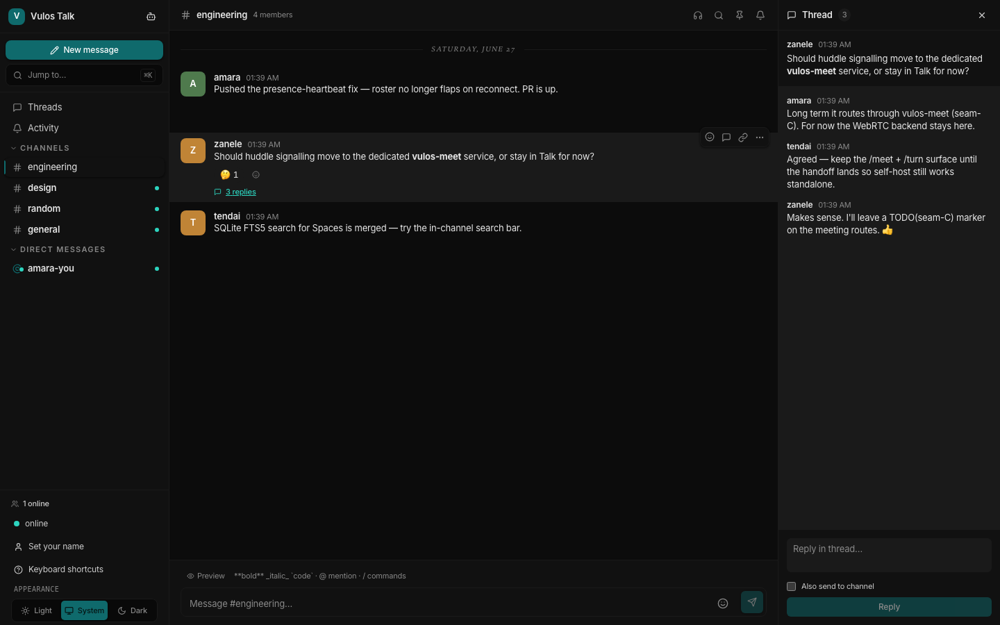
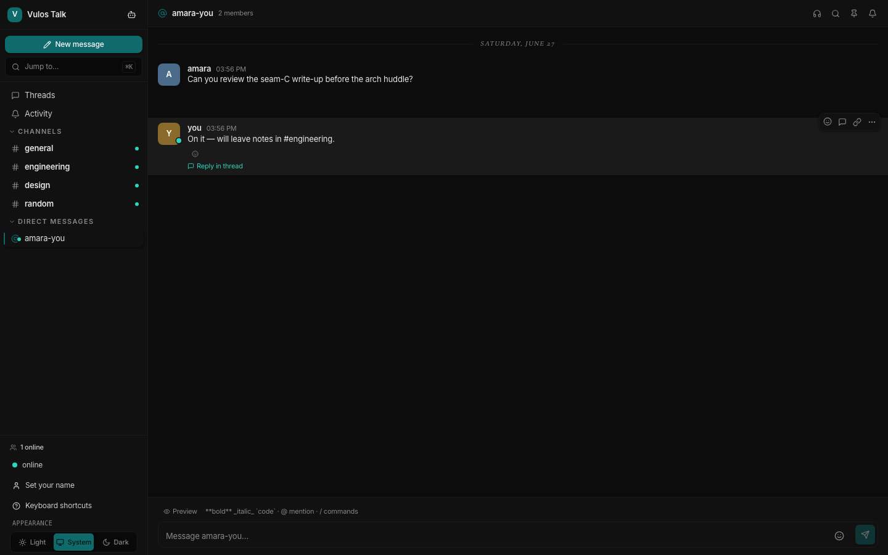
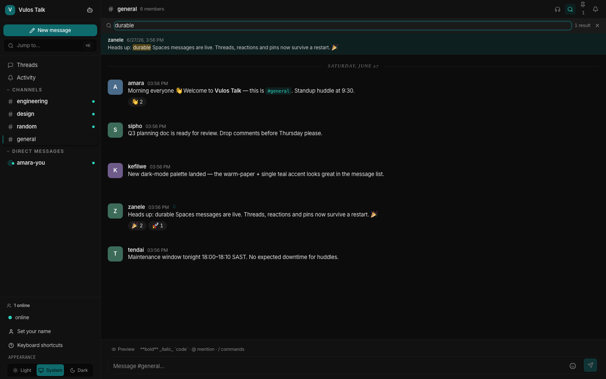
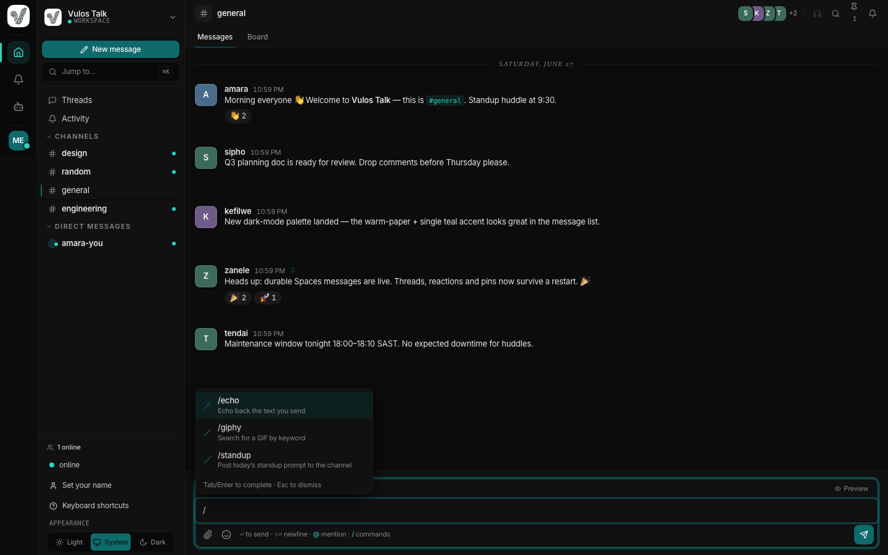
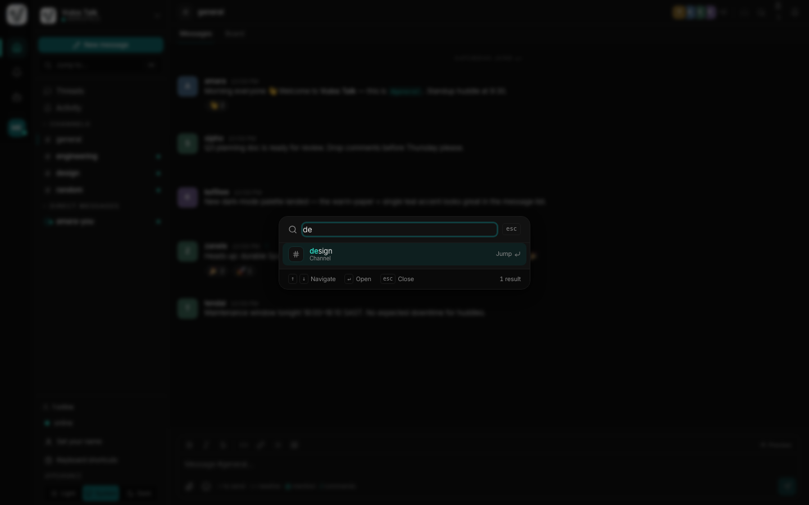
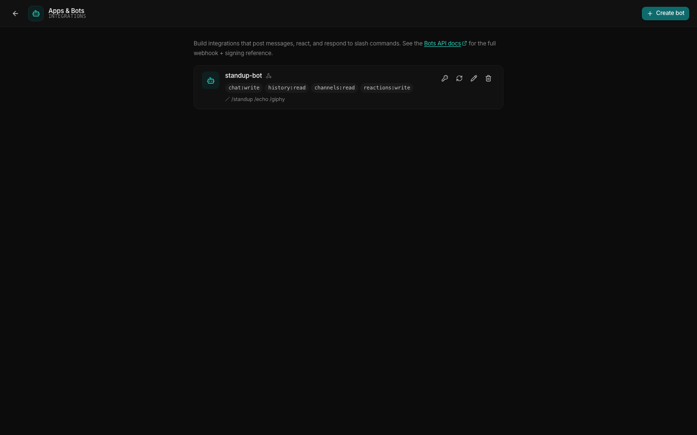
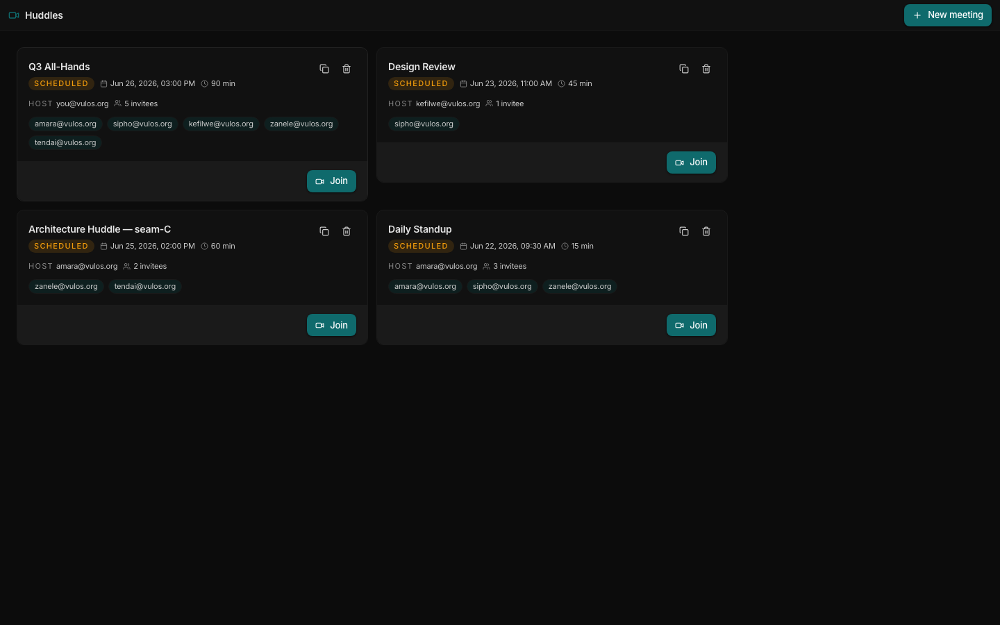
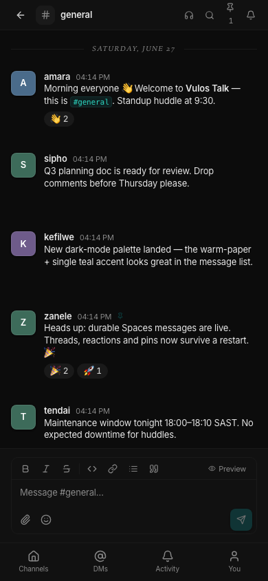

<div align="center">

# Vulos Talk

**Team chat for your own server — a Slack/Google-Chat-class workspace in a single Go binary.**

Channels / DMs · Threads · Reactions · Pins · Search · Presence · Slash commands · Bots & apps · Huddles

[](LICENSE)
[](CHANGELOG.md)
[](https://golang.org)
[](https://react.dev)

<sub> Part of <strong><a href="https://vulos.org">VulOS</a></strong> — the open, self-hostable web OS &amp; app suite. Runs standalone, or combined under one login by <a href="https://vulos.org">Vulos Workspace</a>.</sub>

<br>



</div>

---

## What is Vulos Talk?

Vulos Talk is a self-hostable **team chat** application that ships as **one
self-contained Go binary** with the entire React frontend embedded via
`//go:embed`. It gives a team real-time **Spaces** (public/private channels and
DMs), threaded conversations, emoji reactions, pinned messages, full-text
search, presence, and **huddles** (handed off to the dedicated **Vulos Meet**
product via seam-C, embedded in-channel). Drop the binary next to a `config.yaml`
and it runs — SQLite by default, no external services, no telemetry.

It is **independently self-hostable**: with zero configuration it runs as a
single-user, local-storage app. Everything that *could* tie it to an external
service lives behind a small, clean **seam**, so the core never imports cloud
code — remove the (separate) cloud adapter and the standalone build still
compiles and runs.

## Part of VulOS

[VulOS](https://vulos.org) is an open, self-hostable web OS + app suite. Each
product is self-hostable on its own and can be combined under one login by
**Vulos Workspace**:

- **Vulos Mail** — mail + calendar + contacts (engine: lilmail; UI: `@vulos/mail-ui`; server: vulos-mail)
- **Vulos Talk** — team chat + channels/Spaces + huddles
- **Vulos Meet** — video meetings (LiveKit SFU)
- **Vulos Office** — documents: docs, sheets, slides, PDF
- **Vulos Relay** — sovereign connectivity fabric (`@vulos/relay-client`)
- **Vulos Workspace** — the open suite shell (one login, app switcher, admin)
- **Vulos OS** — the web-native desktop

**Vulos Talk** is the **team-chat product** of the suite: Spaces, DMs, threads,
and huddles. It runs standalone **and** is surfaced by **Vulos Workspace** as
the "Talk" app alongside Mail, Office, and Meet. Workspace links/embeds Talk
through clean seams; products never import one another's code.

> **Seam-C (real-time video):** Talk hosts **no** audio/video itself. Starting a
> huddle in a channel hands off to the dedicated **Vulos Meet** product — Talk
> derives a deterministic Meet room from the channel, mints a `VULOS-MEET/1` join
> token (locally with the shared key/secret, or brokered via the control plane),
> and embeds the Meet web client in an iframe, with Meet's in-call chat pointed
> back at the originating Talk channel so the conversation persists. Meet is an
> **optional** dependency: with no Meet configured the Huddle action shows a
> "video not configured" state and Talk standalone (chat + Spaces) is fully
> functional. Configure via `VULOS_MEET_URL` + `VULOS_MEET_API_KEY` /
> `VULOS_MEET_API_SECRET` (or `VULOS_CP_BASE_URL` to broker). See
> [docs/ARCHITECTURE.md](docs/ARCHITECTURE.md).

## Features

- **Slack/Google-Chat-class UI** — three-pane desktop layout (sidebar · message
  stream · thread panel) with a workspace switcher, collapsible Channels / DMs /
  Threads / Activity sections, unread bolding + mention badges, presence dots, a
  ⌘K quick-switcher, global search, and a `?` keyboard-shortcut overlay.
- **Spaces** — public & private channels plus direct messages and **group DMs**,
  all backed by a CRDT message store that survives restarts (durable SQLite).
- **Dense message stream** — author grouping, day separators, a hover toolbar
  (react · reply-in-thread · edit · delete · pin · copy-link), reactions,
  `@mentions` with autocomplete, Markdown, inline attachments, link previews,
  read/unread with jump-to-unread, and typing indicators.
- **Threads** — Slack-style right-hand thread panel with "also send to channel".
- **Composer** — Markdown + preview, emoji picker, `@mention` and
  **`/slash-command` autocomplete**, attachments, Shift+Enter newline / Enter send.
- **Bots & apps** — a documented bot framework + REST API: bot tokens (hashed at
  rest), signed event webhooks, slash commands, incoming webhooks, an SSE event
  stream, and a self-hostable **Apps & Bots** admin console. See
  [docs/BOT-API.md](docs/BOT-API.md).
- **Search** — SQLite FTS5 full-text search within a channel.
- **Presence** — online/away/DND with custom status (REST/poll heartbeat + roster).
- **Huddles** — seam-C handoff to the dedicated **Vulos Meet** product: a
  per-channel Meet room with a minted `VULOS-MEET/1` join token, embedded in an
  iframe with Meet's in-call chat persisted back to the channel. Optional —
  disabled with a "video not configured" state when no Meet is set.
- **Responsive + a11y** — single-column mobile layout with a channel drawer,
  bottom nav, and full-screen composer; no horizontal scroll at 360px; ≥44px taps.
- **Single binary** — Go backend + embedded React SPA; SQLite by default,
  optional PostgreSQL. Zero telemetry.
- **Standalone-first** — runs with no cloud; an optional control-plane seam is
  engaged only when explicitly configured (including the bot registry seam).

## Screenshots

Generated from a seeded demo backend with `npm run screenshots`
(see [docs/SCREENSHOTS.md](docs/SCREENSHOTS.md)).

| Channel + message stream | Threaded reply |
|---|---|
|  |  |

| Direct message | In-channel search |
|---|---|
|  |  |

| Slash-command autocomplete | Quick switcher (⌘K) |
|---|---|
|  |  |

| Apps & Bots console | Huddles |
|---|---|
|  |  |

| Mobile (single column) | |
|---|---|
|  | |

## Quick start (standalone)

Vulos Talk runs entirely on its own — no other Vulos product is required.

### Build from source

```sh
git clone https://github.com/vul-os/vulos-talk.git
cd vulos-talk

npm install          # frontend deps
npm run build        # vite build → dist/, then go build -o vulos-talk .
./vulos-talk         # serves the API + embedded SPA on :8080
```

Open <http://localhost:8080>. With the default config, auth is disabled and
every request is the single-user `self` identity — ideal for a personal or
LAN deployment.

### Run with Go directly

```sh
npm run build:frontend   # produce dist/ (embedded by the binary)
go run .                 # start the server on :8080
```

### Configure

Copy and edit [`config.yaml`](config.yaml) (server address, data dir, auth,
storage backend). The full reference — including the JWT signing secret,
CORS allowlist, and the optional cloud seam — is in
[docs/CONFIGURATION.md](docs/CONFIGURATION.md).

### Live frontend (development)

```sh
npm run dev:web   # Vite on :5175 proxying /api → :8080
```

## Architecture

```
                ┌────────────────────────── vulos-talk (one Go binary) ──────────────────────────┐
   Browser ──▶  │  gin HTTP server                                                                │
   (React SPA)  │   ├── /api/auth/*        minimal status/me (no login UI; redirects to identity) │
                │   ├── /api/spaces/*      channels · DMs · messages · threads · reactions · pins  │
                │   │                      · status · search · presence · slash-commands           │
                │   │                                                       ──▶  CRDT SpacesStore   │
                │   ├── /api/bots          bot/app admin (create · rotate · scopes · webhooks)      │
                │   ├── /api/bot/v1/*      bot REST API (Bearer bot-token) + SSE event stream       │
                │   ├── /api/bot/hooks/*   per-bot incoming webhooks  ──▶  bots.Registry (seam)     │
                │   ├── /api/meet/config   whether Vulos Meet is configured                       │
                │   ├── …/channels/:id/huddle  seam-C: mint VULOS-MEET/1 join → Vulos Meet        │
                │   ├── /metrics /version  Prometheus + build info                                 │
                │   └── //go:embed dist    serves the built React SPA (history-API fallback)       │
                │                                                                                   │
                │  seam/  ── standalone by default (local JWT, unlimited entitlements, no-op usage) │
                │            optional vulos-cloud control plane (separate adapter; never imported)  │
                └───────────────────────────────────────────────────────────────────────────────┘
```

Full detail and the seam-C huddle/video handoff: [docs/ARCHITECTURE.md](docs/ARCHITECTURE.md).

## Bots & apps

Talk ships a clean, documented **bot/app framework** so you can build
integrations that post messages, react, read history, respond to slash commands,
and receive signed events — equally suited to OSS self-hosting and Vulos
Workspace/Cloud.

- **Bot tokens** — each bot has a Bearer **bot token** (stored only as a sha256
  hash) and a **signing secret**, plus a scope set
  (`chat:write`, `history:read`, `channels:read`, `members:read`, `reactions:write`).
- **REST API** (`/api/bot/v1/`) — post messages, read history, list
  channels/members, add/remove reactions; every route is scope- and
  membership-checked.
- **Signed events** — Talk POSTs `message.created`, `app_mention`,
  `member_joined`, and `slash_command` events to a bot's webhook URL with
  `X-Vulos-Signature: v0=<hmac-sha256>` over `"<timestamp>." + body` (Slack-style),
  verifiable with the signing secret. An **SSE event stream** is also available
  for bots behind NAT (socket-mode style).
- **Slash commands & incoming webhooks** — register `/commands` that POST to your
  handler, and drop messages into a channel via a simple per-bot incoming
  webhook URL.
- **Registry seam (OSS ↔ Cloud)** — a `bots.Registry` interface with a
  **standalone default** (local SQLite store + the **Apps & Bots** admin console,
  zero cloud) and a **control-plane hook** so Vulos Cloud/Workspace can issue and
  manage bot apps per org. Core never imports the cloud adapter — mirroring the
  existing `backend/seam` pattern.

A minimal **example bot** lives in [`examples/echo-bot/`](examples/echo-bot/).
Full reference: **[docs/BOT-API.md](docs/BOT-API.md)**.

## Configuration

Talk is configured via `config.yaml` plus a few environment variables (JWT
secret, CORS allowlist, optional `VULOS_MEET_*` huddle handoff, optional cloud
base URL). See [docs/CONFIGURATION.md](docs/CONFIGURATION.md) for the complete
reference.

Talk does not host its own login UI: the `RequireAuth` boundary redirects an
unauthenticated user to the central identity surface (`app.vulos.org/login`) and
relies on the shared `vulos.org` session cookie. When `auth.enabled` is `false`
(the self-host default) every request is the single-user `self` identity.

## Documentation

| Document | What's in it |
|----------|--------------|
| [docs/ARCHITECTURE.md](docs/ARCHITECTURE.md) | Components, request flow, the integration seam, and the `seam-C` roadmap |
| [docs/CONFIGURATION.md](docs/CONFIGURATION.md) | `config.yaml` reference + environment variables |
| [docs/API.md](docs/API.md) | REST API surface (Spaces, Meetings, Huddles, presence) |
| [docs/BOT-API.md](docs/BOT-API.md) | Bot framework: tokens, REST API, signed events, slash commands, incoming webhooks, registry seam |
| [docs/SCREENSHOTS.md](docs/SCREENSHOTS.md) | How the demo screenshotter works + how to regenerate |
| [CHANGELOG.md](CHANGELOG.md) | Release history (Keep a Changelog) |

## Development

```sh
npm install            # install frontend deps
npm run build          # vite build + go build -o vulos-talk .
npm test               # frontend unit tests (vitest)
go test ./...          # backend tests
npm run screenshots    # regenerate docs/screenshots/ from seeded demo data
```

## Contributing

Issues and pull requests are welcome. Please keep changes conservative and make
sure `npm run build`, `go build ./...`, `go test ./...`, and `npm test` all pass
before opening a PR.

## License

[MIT](LICENSE) © Imran Paruk
